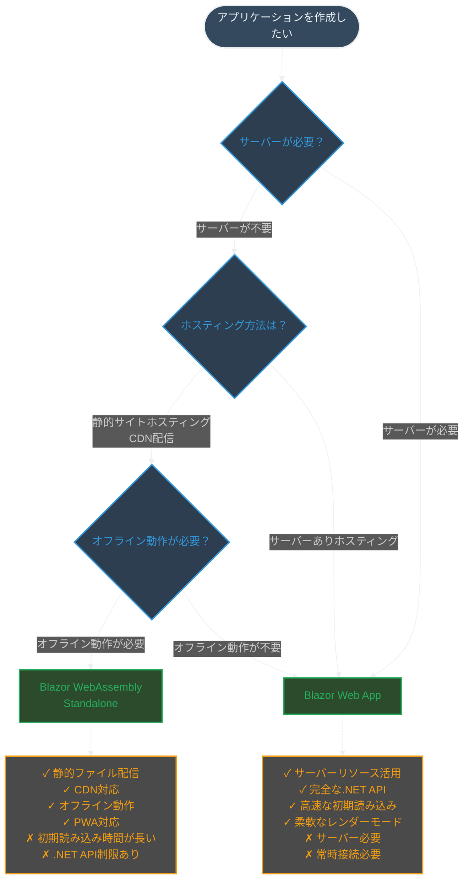
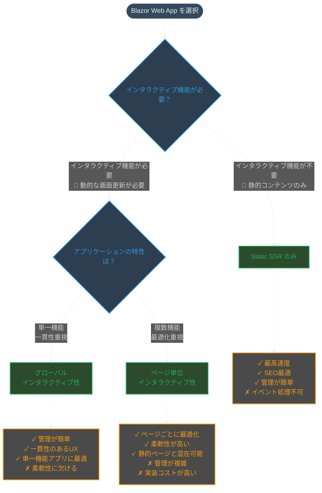
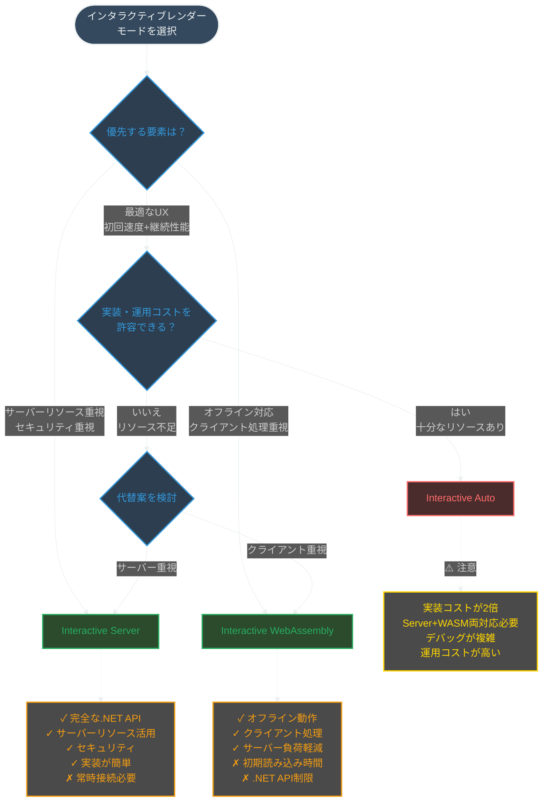

# ASP.NET Core Blazor Web App (.NET 8以降) - レンダーモード選択ガイド

.NET 8 以降の Blazor Web App では、コンポーネントレベルでレンダーモードを選択できるようになりました。従来のホスティングモデルという概念から、**レンダーモード**という概念に変わり、より柔軟にアプリケーションを構築できます。

## Blazor Web App の選択肢

### 1. **Static SSR（静的サーバーサイドレンダリング）**

**特徴：**
- サーバーで HTML を生成し、インタラクティブ機能なし
- 最も高速な初期読み込み
- SEO に最適
- イベントハンドラーは動作しない

**使うべき場面：**
- 静的なコンテンツ表示
- SEO が重要なページ
- 高速な初期読み込みが必要
- データ表示のみのページ

### 2. **Interactive Server**

**特徴：**
- SignalR を使用したサーバーサイドでのインタラクティブ処理
- 完全な .NET API アクセス
- サーバーリソースを活用
- リアルタイム通信

**使うべき場面：**
- サーバーリソースへの直接アクセスが必要
- 完全な .NET API が必要
- セキュリティが重要（コードがサーバー側に保護される）
- データベースアクセスが頻繁
- リアルタイム機能が必要

### 3. **Interactive WebAssembly**

**特徴：**
- クライアントサイドで実行
- オフライン動作可能
- サーバー負荷軽減
- 静的ホスティング可能

**使うべき場面：**
- オフライン動作が必要
- サーバー負荷を軽減したい
- 静的サイトホスティング（CDN）を使用
- クライアント側で重い処理を実行
- PWA (Progressive Web App) を構築

### 4. **Interactive Auto**

**特徴：**
- 初回はサーバーサイドで実行
- バックグラウンドで WebAssembly をダウンロード
- 2回目以降の訪問時は WebAssembly で実行
- 両方の利点を組み合わせ

**使うべき場面：**
- 初回の高速読み込みとその後の高性能を両立したい
- ユーザーが繰り返し訪問するアプリケーション
- 最適なユーザーエクスペリエンスを提供したい

**⚠️ 注意：実装とコストの複雑さ**
- **開発コスト**: Server と WebAssembly の両方に対応する必要があり、実装難易度が大幅に上がる
- **運用コスト**: サーバーリソースとクライアントリソースの両方を管理する必要がある
- **デバッグ**: 2つの異なる実行環境でのテストと問題の切り分けが必要
- **バンドルサイズ**: WebAssembly のダウンロードが必要で、初期表示は早いが総データ量は多い

## Blazor WebAssembly Standalone

### **Blazor WebAssembly Standalone**

**特徴：**
- 完全にクライアントサイドで実行される単独アプリケーション
- ASP.NET Core サーバーが不要
- 静的ファイルとして配信可能
- CDN やスタティックホスティングサービスで配信可能

**使うべき場面：**
- サーバーを持たないアプリケーション
- 完全にオフラインで動作するアプリケーション
- GitHub Pages や Azure Static Web Apps での配信
- シンプルな SPA (Single Page Application) を構築
- サーバーコストを削減したい

**制限事項：**
- .NET API のサブセットのみ利用可能
- 初期読み込み時間が長い
- サーバー側機能は Web API 経由でのみアクセス可能

## 選択フロー

以下のフローチャートは、Blazor アプリケーションの選択を3段階に分けて示しています。まずアプリケーションの基本的な構成を決定し、次にインタラクティブ性の適用範囲を選択し、最後に具体的なレンダーモードを決定します。

> **💡 インタラクティブ機能とは？**
> - **あり**: ボタンクリック、フォーム入力、リアルタイム更新など、ユーザーの操作に応じて画面が動的に変化する機能
> - **なし**: 静的なHTMLページと同様で、リンクやフォーム送信による画面遷移のみ可能

### 1. Blazor WebAssembly Standalone vs Blazor Web App の判断



### 2. Blazor Web App でのグローバル vs ページ単位インタラクティブ性の判断



### 3. インタラクティブレンダーモードの選択



## インタラクティブ性の適用範囲

### グローバルインタラクティブ性
- アプリケーション全体で同じレンダーモードを使用
- 管理が簡単で、一貫性のあるユーザーエクスペリエンス
- 単一機能のアプリケーションに適している

### ページ/コンポーネント単位のインタラクティブ性
- ページやコンポーネントごとに異なるレンダーモードを選択可能
- 各ページの要件に応じた最適化が可能
- より複雑だが、柔軟性が高い

## レンダーモードの選択基準

| 要件 | 推奨選択肢 | 実装難易度 |
|------|-----------|-----------|
| 高速な初期読み込み | Static SSR | 低 |
| SEO 最適化 | Static SSR | 低 |
| オフライン動作 | Interactive WebAssembly / Blazor WebAssembly Standalone | 中 |
| 完全な .NET API アクセス | Interactive Server | 低 |
| リアルタイム通信 | Interactive Server | 中 |
| サーバー負荷軽減 | Interactive WebAssembly / Blazor WebAssembly Standalone | 中 |
| 静的ホスティング | Interactive WebAssembly / Blazor WebAssembly Standalone | 中 |
| 最適なUX（初回＋継続） | Interactive Auto | **高** |
| セキュリティ重視 | Interactive Server | 低 |
| サーバーレス | Blazor WebAssembly Standalone | 中 |

## 実践的な使い分け例

### 1. **コーポレートサイト**
- **選択肢**: Blazor Web App（混在モード）
- **静的ページ（会社情報、製品紹介など）**: Static SSR（SEO重視）
- **お問い合わせフォーム**: Interactive Server（データベースアクセス）

### 2. **Eコマースサイト**
- **選択肢**: Blazor Web App（混在モード）
- **商品一覧ページ**: Static SSR（SEO重視）
- **ショッピングカート**: Interactive WebAssembly（オフライン対応）

### 3. **業務アプリケーション**
- **選択肢**: Blazor Web App（Interactive Server グローバル）
- **推奨理由**: 業務アプリケーションは通常、データベースアクセスが頻繁でセキュリティが重要。Interactive Auto は開発・運用コストが高いため、特別な要件がない限り Interactive Server を推奨
- **備考**: 繰り返し利用される業務アプリで、かつ開発・運用リソースが十分にある場合のみ Interactive Auto を検討

### 4. **ポートフォリオサイト**
- **選択肢**: Blazor WebAssembly Standalone
- **GitHub Pages で配信**: 静的ホスティング
- **完全にオフライン動作**: サーバー不要

### 5. **デモアプリケーション**
- **選択肢**: Blazor WebAssembly Standalone
- **CDN で配信**: コスト削減
- **シンプルな SPA**: サーバーレス

### 6. **Interactive Auto を選択すべき場面**
- **エンタープライズアプリケーション**で、開発・運用チームが充実している
- **頻繁に利用されるアプリケーション**で、UX への投資対効果が高い
- **長期運用が前提**で、初期投資コストを回収できる見込みがある
- **技術的負債を管理できる体制**が整っている

## 注意点

### 1. **レンダーモードの伝播**
- 親コンポーネントのレンダーモードが子コンポーネントに伝播される
- 異なるインタラクティブモード間での切り替えは不可

### 2. **パラメータの制限**
- Static 親から Interactive 子にパラメータを渡す場合、JSON シリアライズ可能である必要がある
- RenderFragment や子コンテンツは渡せない

### 3. **プロジェクト構成**
- WebAssembly や Auto モードを使用する場合、`.Client` プロジェクトが必要
- WebAssembly コンポーネントは `.Client` プロジェクトに配置
- Blazor WebAssembly Standalone は単一プロジェクト構成
- **Interactive Auto の場合**: Server と Client の両方のプロジェクトを管理する必要があり、依存関係の管理が複雑化

### 4. **Interactive Auto の実装コスト**
- **開発時間**: 単一モードの約2倍の実装時間が必要
- **テスト工数**: Server と WebAssembly の両方での動作確認が必要
- **保守性**: 2つの実行環境での問題の切り分けと対応が必要
- **チーム要件**: Server 側と Client 側の両方の技術スタックに精通したメンバーが必要

### 5. **プリレンダリングの注意点**
Interactive Server、Interactive WebAssembly、Interactive Auto の3つのモードは、**デフォルトでプリレンダリングが有効**になっています。

**プリレンダリングとは：**
- サーバー側で最初にHTMLを生成し、クライアント側で再度レンダリングを行う仕組み
- SEO最適化には有効だが、意識をしていないと処理が2重実行される場合がある

**プリレンダリングが不要なケース：**
- 業務アプリケーションなど、SEOが不要なアプリケーション
- 初期化処理が重い場合（データベースアクセス、Web API呼び出しなど）
- クライアント専用のサービス（WebAssembly専用API）を使用する場合

**プリレンダリングの無効化方法：**

#### コンポーネントインスタンスでの無効化
```razor
<!-- Interactive Server -->
<MyComponent @rendermode="new InteractiveServerRenderMode(prerender: false)" />

<!-- Interactive WebAssembly -->
<MyComponent @rendermode="new InteractiveWebAssemblyRenderMode(prerender: false)" />

<!-- Interactive Auto -->
<MyComponent @rendermode="new InteractiveAutoRenderMode(prerender: false)" />
```

#### コンポーネント定義での無効化
```razor
@rendermode @(new InteractiveServerRenderMode(prerender: false))
```

#### アプリケーション全体での無効化
`Components/App.razor` で設定：
```razor
<Routes @rendermode="new InteractiveServerRenderMode(prerender: false)" />
<HeadOutlet @rendermode="new InteractiveServerRenderMode(prerender: false)" />
```

#### カスタムレンダーモード（省略記法）
頻繁に使用する場合は、カスタムクラスを作成して省略記法を定義：

**1. カスタムクラスを作成**（例：`CustomRenderModes.cs`）：
```csharp
using Microsoft.AspNetCore.Components;
using Microsoft.AspNetCore.Components.Web;

public static class CustomRenderModes
{
    public static IComponentRenderMode InteractiveServerWithoutPrerendering { get; } = 
        new InteractiveServerRenderMode(prerender: false);
        
    public static IComponentRenderMode InteractiveWebAssemblyWithoutPrerendering { get; } = 
        new InteractiveWebAssemblyRenderMode(prerender: false);
        
    public static IComponentRenderMode InteractiveAutoWithoutPrerendering { get; } = 
        new InteractiveAutoRenderMode(prerender: false);
}
```

**2. `Components/_Imports.razor` で using を追加**：
```razor
@using static CustomRenderModes
```

**3. 使用例**：
```razor
@rendermode InteractiveServerWithoutPrerendering
```

**⚠️ 注意点：**
- プリレンダリングを無効化すると、SEO効果が低下する
- 初期表示が遅くなる可能性がある
- 業務アプリケーションではSEOが不要な場合が多いため、パフォーマンスを優先してプリレンダリングを無効化することを推奨

## 参考ドキュメント

### 公式ドキュメント
- [ASP.NET Core Blazor render modes](https://learn.microsoft.com/en-us/aspnet/core/blazor/components/render-modes?view=aspnetcore-9.0)
- [ASP.NET Core Blazor hosting models](https://learn.microsoft.com/en-us/aspnet/core/blazor/hosting-models?view=aspnetcore-9.0)
- [Tooling for ASP.NET Core Blazor](https://learn.microsoft.com/en-us/aspnet/core/blazor/tooling?view=aspnetcore-9.0)
- [ASP.NET Core Blazor project structure](https://learn.microsoft.com/en-us/aspnet/core/blazor/project-structure?view=aspnetcore-9.0)

### 選択基準とベストプラクティス
- [Choose Between Traditional Web Apps and Single Page Apps (SPAs)](https://learn.microsoft.com/en-us/dotnet/architecture/modern-web-apps-azure/choose-between-traditional-web-and-single-page-apps)
- [ASP.NET Core Blazor](https://learn.microsoft.com/en-us/aspnet/core/blazor/?view=aspnetcore-9.0)
- [Build a .NET MAUI Blazor Hybrid app with a Blazor Web App](https://learn.microsoft.com/en-us/aspnet/core/blazor/hybrid/tutorials/maui-blazor-web-app?view=aspnetcore-9.0)
- [Build a Blazor movie database app (Part 8 - Add interactivity)](https://learn.microsoft.com/en-us/aspnet/core/blazor/tutorials/movie-database-app/part-8?view=aspnetcore-9.0)